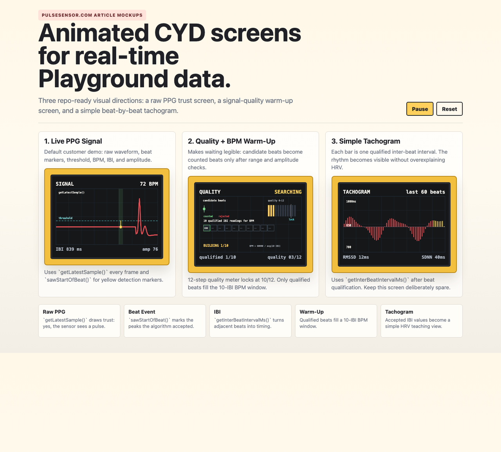
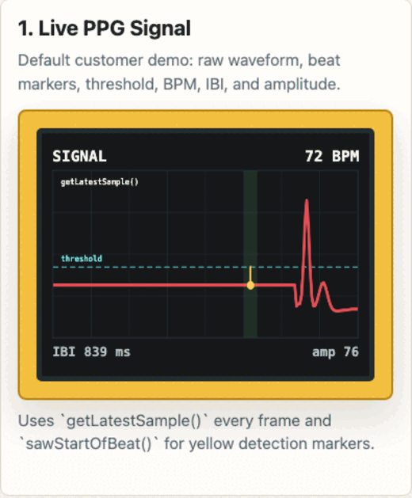
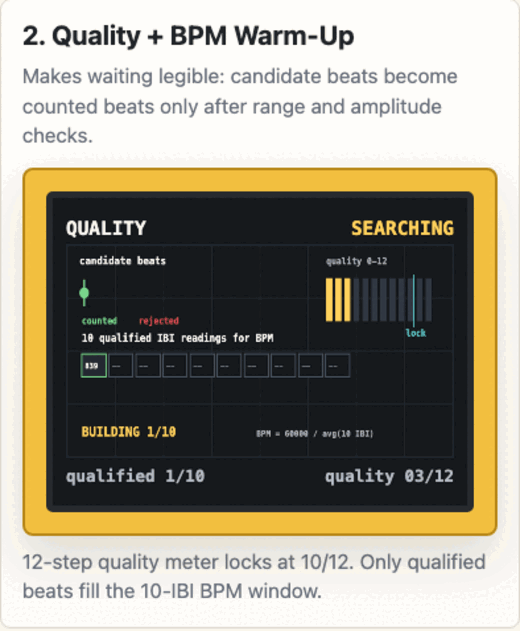
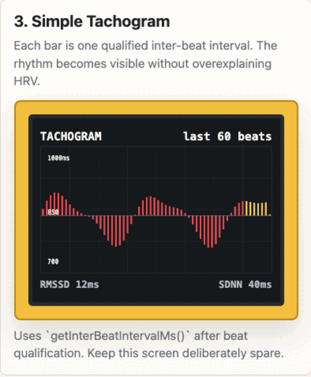

# PulseSensor CYD Real-Time Design Archive

Visual experiments for a PulseSensor.com customer tutorial and ESP32 CYD project. The goal is to make PulseSensor Playground data feel immediate: raw PPG, detected beats, signal quality, BPM warm-up, and a simple tachogram.

The live prototype is in [`animated-mockups.html`](animated-mockups.html). The README keeps a visual record that works directly on GitHub without running the page.



## Animated Contact Sheet

| Live PPG signal | Signal quality + BPM warm-up | Simple tachogram |
| --- | --- | --- |
|  |  |  |

## What This Teaches

- `getLatestSample()` draws the live pulse waveform.
- `sawStartOfBeat()` marks each detected beat.
- `getBeatsPerMinute()` provides the familiar BPM number.
- `getInterBeatIntervalMs()` feeds the tachogram and beat-to-beat timing views.
- `getPulseAmplitude()` helps qualify whether a beat is trustworthy enough to count.

```text
raw PPG sample -> beat event -> IBI -> 10-IBI BPM window -> tachogram
```

## Design Directions

| Screen | Purpose | Playground data |
| --- | --- | --- |
| Live PPG waveform | Prove the sensor is reading a pulse | `getLatestSample()`, `sawStartOfBeat()` |
| Signal quality + BPM warm-up | Show why BPM waits before it becomes trusted | `getBeatsPerMinute()`, `getInterBeatIntervalMs()`, `getPulseAmplitude()` |
| Simple tachogram | Show IBI changing from beat to beat | `getInterBeatIntervalMs()` |

The live PPG screen is the default customer demo. The tachogram stays intentionally simple: each bar is one accepted IBI, centered around the recent mean.

## Signal Quality And BPM Warm-Up

The quality logic follows the working CYD launcher sketch and makes the warm-up period visible:

- Keep a 12-step signal quality meter.
- Raise quality on qualified beats and reduce it on questionable beats.
- Treat the signal as locked at `10/12`.
- Only qualified beats enter the BPM window.
- Fill a rolling 10-IBI window before showing the stable BPM.
- Compute warm-up BPM as `60000 / average(qualifiedIbis)`.

```cpp
bool beatIsQualified(int bpm, int ibi, int amplitude) {
  if (bpm < 40 || bpm > 180) return false;
  if (ibi < 333 || ibi > 1500) return false;
  if (amplitude < 20) return false;
  return true;
}
```

That gives the customer a clear explanation for the moment between "I see a pulse wave" and "the display trusts this BPM."

## Repo Shape

```text
.
|-- README.md
|-- animated-mockups.html              # Browser prototype with canvas animation
|-- index.html                         # Longer PulseSensor.com article mockup
|-- firmware/
|   `-- PulseSensor_CYD_Demo/
|       `-- PulseSensor_CYD_Demo.ino    # One-file Arduino sketch
`-- docs/
    |-- animations/                    # GitHub-renderable GIF loops
    `-- screenshots/                   # PNG/SVG design captures
```

## Article Narrative

1. Start with a recognizable pulse waveform.
2. Show which peaks became beats.
3. Explain IBI as the time between accepted beats.
4. Show signal quality so waiting feels intentional.
5. Fill the 10-IBI BPM window.
6. Draw a simple tachogram from accepted IBI values.

The key line for the article:

> The PulseSensor Playground library gives you samples, beats, BPM, IBI, and amplitude. The CYD turns those values into pictures customers can understand.

## Hardware Target

- Board: ESP32-2432S028R CYD / Cheap Yellow Display
- Display: ILI9341 320 x 240 TFT
- Sensor: PulseSensor signal wire on an ESP32 analog input
- Known working launcher pin: `GPIO 35`
- CYD backlight: `GPIO 21`
- CYD RGB LED: red `GPIO 4`, green `GPIO 16`, blue `GPIO 17`

The current firmware lives in one beginner-readable Arduino file:
[`firmware/PulseSensor_CYD_Demo/PulseSensor_CYD_Demo.ino`](firmware/PulseSensor_CYD_Demo/PulseSensor_CYD_Demo.ino).

It includes:

- CYD `TFT_eSPI` display setup defines
- PulseSensor Playground setup
- Live PPG waveform screen
- Signal quality and 10-IBI BPM warm-up screen
- Simple tachogram screen
- Rear red LED beat flash
- Auto-cycling display modes

## Flashing The Current CYD Launcher

```bash
arduino-cli compile --fqbn esp32:esp32:esp32 firmware/PulseSensor_CYD_Demo
```

Because the sketch includes the CYD `TFT_eSPI` setup defines, it does not require a separate `User_Setup.h` edit for this known display configuration.

## Visual Evolution

This repo is meant to preserve design movement, not just final code. When a new screen direction is worth remembering:

1. Add or update the HTML prototype.
2. Export a static PNG contact sheet.
3. Export one short GIF per key screen.
4. Put the new assets in `docs/screenshots/` and `docs/animations/`.
5. Update this README so GitHub tells the visual story at a glance.

## Source Notes

- PulseSensor Playground API references come from the local `pulsesensor-playground` checkout used during prototyping.
- The 12-step quality meter and lock behavior come from the local `cyd-app-launcher/CYD_App_Launcher.ino` sketch.
- The current publishable direction comes from these prototype commits:
  - `3930697 build: tighten signal quality layout`
  - `41465bf build: add signal quality bpm warmup demo`
  - `c2c404d build: simplify tachogram keep signal annotations`
  - `c8f5b0d build: capture realtime demo tachogram experiment`

This software is an educational biofeedback demo and is not intended for medical use.
